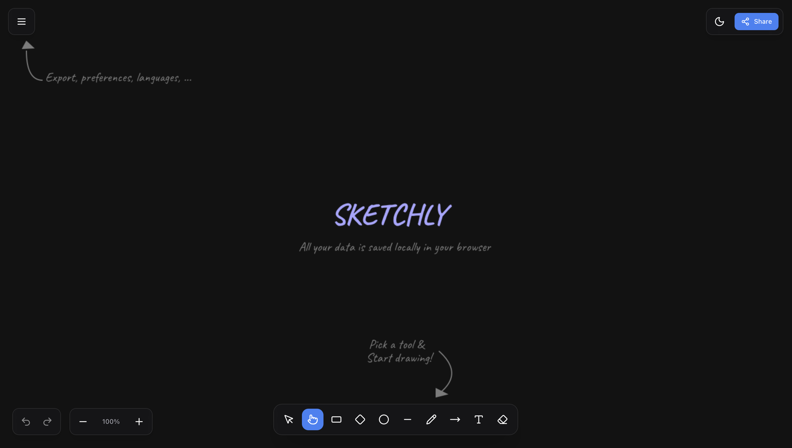

# Sketchly

Sketchly is a real-time collaborative whiteboard application designed to help teams and individuals brainstorm, plan, and visualize ideas seamlessly. Built with modern web technologies, it offers a smooth and responsive drawing experience.




## 🚀 Features

- **Canvas Drawing**: Freehand, shapes and editable text
- **Real-time Collaboration**: Work together with others on the same whiteboard in real-time.
- **Eraser Tool**: Remove individual shapes
- **Freehand Drawing**: Smooth and natural drawing experience.
- **Modern UI**: Clean and intuitive interface built with Tailwind CSS.
- **Responsive Design**: Works great on different screen sizes.

## 🛠️ Technologies Used

Sketchly is built using a modern tech stack within a **TurboRepo** monorepo structure:

- **Frontend**: [Next.js 16](https://nextjs.org/) (React 19)
- **Language**: [TypeScript](https://www.typescriptlang.org/)
- **Styling**: [Tailwind CSS 4](https://tailwindcss.com/)
- **Icons**: [Lucide React](https://lucide.dev/) & [Tabler Icons](https://tabler-icons.io/)
- **Free-hand drawing**: [perfect-freehand](https://github.com/steveruizok/perfect-freehand)
- **Package Manager**: [pnpm](https://pnpm.io/)
- **Build System**: [TurboRepo](https://turbo.build/)

## 📂 Project Structure

The project follows a monorepo structure:

```
.
├── apps
│   └── sketchly          # Main Next.js frontend
├── packages
│   ├── ui                # Shared UI components
│   ├── eslint-config     # Shared ESLint configurations
│   └── typescript-config # Shared TypeScript configurations
├── assets
│   └── thumbnail.png     # Project assets
├── package.json
├── pnpm-lock.yaml
├── pnpm-workspace.yaml
└── turbo.json
```

- **`apps/sketchly`**: The main Next.js frontend application.
- **`packages/ui`**: Shared UI components.
- **`packages/eslint-config`**: Shared ESLint configurations.
- **`packages/typescript-config`**: Shared TypeScript configurations.

## ⚡ Getting Started

Follow these steps to set up the project locally.

### Prerequisites

- **Node.js**: Version 18 or higher.
- **pnpm**: This project uses pnpm as the package manager.

### Installation

1.  **Clone the repository:**

    ```bash
    git clone https://github.com/dakshydv/sketchly.git
    cd sketchly
    ```

2.  **Install dependencies:**

    ```bash
    pnpm install
    ```

### Running the Development Server

To start the development server for the application:

```bash
pnpm dev
```

This command runs `turbo run dev`, which starts the Next.js app. Open [http://localhost:3000](http://localhost:3000) in your browser to see the app.

### Building for Production

To build the application for production:

```bash
pnpm build
```

### Linting

To run the linter across the project:

```bash
pnpm lint
```

## 🤝 Contributing

Contributions are welcome! Please feel free to submit a Pull Request.
